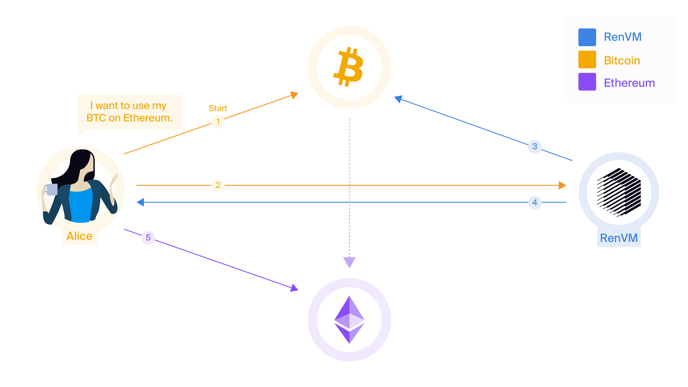

In this Wiki, we present RenVM, a Byzantine fault tolerant network that enables universal interoperability between blockchains. By combining PBFT consensus with secure MPC algorithms, RenVM is able to instantiate a decentralised, permission-less, and trust-less custodian capable of locking assets on one chain, and minting one-to-one pegged representations of them on other chains. In this way, users are able to interact with multiple applications, with multiple assets, spanning multiple chains with only a single transaction. Throughout this wiki, we discuss how RenVM is able to achieve this, using BTC-on-Ethereum as a particularly interesting case study.

1. [Introduction](#introduction)
    1. [Universal Interoperability](#universal-interoperability)
    2. [Related Work](#related-work)
    3. [RenVM](#renvm)
2. [How It Works](#how-it-works)
    1. [Darknodes](#darknodes)
    2. [Shards](#shards)
    3. [Fees](#fees)
3. [Cross-chain Transactions](#cross-chain-transactions)
    1. [Lock and Mint](#lock-and-mint)
    2. [Burn and Release](#burn-and-release)
    3. [Burn and Mint](#burn-and-mint)

## Introduction

Blockchains have enabled a new approach to technology and finance, one where users are self sovereign, and do not need to trust centralised third-parties or intermediaries. Since their inception, blockchains have found the most adoption in financial applications, allowing users to store and transfer value, purchase goods, and earn interest. In somewhat of a contradiction, most of this activity has taken place on centralised exchanges and websites, where central authorities are able to subvert and censor users. However, in the past few years, the rapidly growing DeFi movement has aimed to empower users by giving them access all of the same functionality, but without the need for centralised third-parties and intermediaries. DeFi encompasses many kinds of decentralised applications, but ultimately it is an attempt to enable sending, lending exchanging, and leveraging (and more) without needing to leave the Byzantine resistant world of the blockchain.

Now, the struggle has changed. To scale this new class of financial technology (and not in the transactions-per-second kind of way), a major shortcoming of blockchains must be addressed: interoperability. At the time of writing, Bitcoin is 9x larger than Ether, and eclipses all other cryptocurrencies. It is worth more than the next 100 largest cryptocurrencies combined. But, despite its dominance, no general purpose interoperability solution exists that does not require centralised third-parties. Furthermore, this is a deficiency that extends beyond Bitcoin. None of the top ten blockchains (ranked by market capitalisation of their assets) are interoperable with one another.

Interoperability presents a major challenge, but it is critical for the continued growth of blockchains and the financial technologies built upon them. For DEXs to grow, access to more liquid assets is needed. For lending platforms to grow, access to more interesting and diverse assets is needed. For synthetics and derivatives to grow, access to higher market cap assets is needed. For the ecosystem to take the next step, we need to connect our users. Network effects that are achieved on one chain should not need to be replicated on others, applications that are built, battle-tested, and adopted on one chain should not need to be built again, and competition should encourage innovation and improvement instead of cloning. Interoperability will not solve all of the challenges with blockchains, but it does solve some of them, and lay the foundations for solving many more. 

To this end, we have developed RenVM — the design of which will be the focus of this wiki — with the intent to bring interoperability to all blockchains, developers, and users. RenVM is designed with careful consideration for simplicity of use, and is able to offer a *native* user experience, where users are only ever required to make a single transaction from a single chain. Such a transaction can kick-off arbitrarily complex logic that spans many applications, many assets, and most importantly, many chains. We call this universal interoperability.

### Universal Interoperability

Interoperability is quite an overloaded term, used to describe many different kinds of functionality. We will dive into some of these definitions in a moment, but first, it is worth giving our own definition to provide clarity on exactly what RenVM is built to accomplish.

We define *universal interoperability* as the ability to send any asset from any chain to any other chain for use in any application. Furthermore, we require that such a universal interaction, spanning multiple assets, chains, and applications, must be executed as the result of one transaction made by the user. For example, a universal interoperability protocol must allow a user to exchange BTC for ZEC on an Ethereum DEX, send that ZEC to Polkadot where it is used to collateralise a stable-coin, and send that stable-coin back to Ethereum where it is lent out to another user, and all of this must happen as a result of only one Bitcoin transaction made in the first step. It is worth explicitly noting that universal interoperability protocols must not make any assumptions about the specific applications that will be using them. Many of the decentralised applications available today could not have been imagined when blockchains were first brought to the world by Satoshi Nakamoto, and a universal interoperability protocol must ensure that it works for use cases that we still have not imagined today. 

### Related Work

There have been many attempts to achieve various forms of interoperability between blockchains, most of which have focused on interactions between Bitcoin and Ethereum. In this section, we will discuss some of the existing solutions that have been proposed, and look at their major advantages and disadvantages.

*Atomic swaps* — or, as they are sometimes miscalled, HTLCs — use special Bitcoin scripts and Ethereum contracts to guarantee that BTC is swapped for ETH/ERC20s in full, or not at all. Consider Alice trying to swap BTC for ETH with Bob. Alice will not get custody of the ETH, unless Bob is able to get custody of the BTC, and vice versus. Although atomic swaps have many desirable properties, they have two major drawbacks:

1. They are not universally applicable. Atomic swaps are only usable for swapping, and Alice and Bob must already agree on the assets and the price-point. This makes them very limited in where they can be used. We cannot use atomic swaps to create cross-chain collateralised derivatives, automated market-makers, etc. and so other solutions are needed. This problem is particularly apparent when we realise that we want to support applications that may not even exist today, and so we need solutions that are as general as possible.
2. They suffer from the free-option problem. Atomic swaps require long timeouts to function correctly. Alice or Bob could intentionally participate slowly, observing market conditions to see if the swap continues to be favourable. A market movement will always make the swap unfavourable for one party, and that party can then cancel the swap. This gives the parties the “option” to back out of a deal that becomes unfavourable. Alice and Bob are both strongly incentivised behave this way, especially for large amounts, and so other incentives (e.g. reputation) need to be brought into the equation.

*Synthetics* are another form of interoperability that aim to give users exposure to the price of an underlying asset. For example, Dai is a synthetic that gives users exposure to USD. Synthetics generally require the user to deposit an excess amount of collateral to mint a smaller amount of the synthetic asset (e.g. every $150 of collateral allows the minting of $100 of synthetics). If the value of the collateral drops too much with respect to the value of the synthetic, then the collateral is *liquidated*. This means it is taken from the user, and used to buy-back-and-burn the synthetic asset that was minted.

1. Synthetics are not redeemable for the underlying asset, they are only pegged to be approximately the same price. If you have synthetic BTC, but you now want real BTC, you need to find a counter-party that is willing to make that trade with you.
2. Synthetics cannot interact with other chains. A synthetic that has been minted on one chain can only interact with contracts and assets on that chain, unless it leverages a different interoperability solution. For example, Dai cannot be moved from Ethereum unless it does so on the back of an interoperability solution like RenVM.
3. Liquidation mechanisms have been known to fail during times of high market volatility. This is problematic, because times of high market volatility are exactly the times when you want your assets to be the most stable/usable. Mass liquidations and rapid price movements can result in synthetic assets that are under-collateralised, and this unpegs their price.

*Tokenised representations* are the most flexible kind of interoperability, and can be implemented in many different ways. For example, there is WBTC, imBTC, TBTC, and pBTC. RenVM also uses tokenised representation to implement universal interoperability. Tokenised representation is where the user locks up an asset with a custodian, and the custodian mints a one-to-one backed token for the user on another chain. This token can then be burned, and the custodian releases the respective amount of the locked asset back to the user. All of the existing tokenised representation models exhibit serious problems for universal interoperability:

1. WBTC and imBTC both trust a centralised custodian to keep the locked assets secure. While there are many valid use-cases for WBTC and imBTC, they are not decentralised, permission-less, or trust-less. WBTC also enforces that only authorised merchants can request minting/burning, making it impossible for users to directly create/redeem WBTC.
2. TBTC requires synthetic-like over-collateralisation and liquidation. This means the one-to-one peg can be broken by market volatility, and the signers that power the network must accept a lot of risk for little ROI (compared to other investments). It also only supports fixed lot sizes of BTC that can be minted/burned, and requires multiple transactions on both chains, making it overly restrictive for users. 
2. pBTC assumes that trusted execution environments are secure enough to resist the attacks of rational adversaries. In practice, many vulnerabilities have recently been discovered that subvert these security assumptions. If pBTC was to lock large amounts of BTC, the incentive to advance and exploit these vulnerabilities would be massive.

### RenVM

RenVM implements universal interoperability using the *tokenised representation* model. However, it introduces several advances that solve many of the technical and economic problems facing other tokenised representation solutions.

RenVM replaces the role of the trusted custodian with a decentralised custodian. This decentralised custodian is implemented using the *RZL MPC algorithm*, which can generate and manage ECDSA private keys without ever exposing them (not even to the machines that power RenVM). This improves on WBTC and imBTC by removing the need to trust a centralised custodian.

RenVM uses *bonding* and *algorithmically adjusted fees* to make sure that attacks are never profitable, and to always be able to restore the one-to-one peg if an attack ever does succeed. This improves on TBTC by removing the need for liquidation, which can cause a permanent loss of the one-to-one peg during times of high market volatility. It also improves on pBTC by not relying on trusted execution environments, which have been shown to be exploitable. This approach also allows RenVM to scale its capacity to meet demand: as more assets are locked in RenVM, the algorithmic adjustment of fees allows RenVM to automatically increase its capacity for more locked assets. This is an improvement over TBTC, which requires its signers to explicitly acquire and bond more collateral to increase its capacity.

Lastly, RenVM is designed with careful consideration for the user experience. It allows the minting/burning of pegged assets by anyone, at any time, and at any quantity. Minting/burning of the pegged assets only ever requires *at most one transaction* from the user, and can have application-data attached to allow the direct calling of smart contracts. This allows for some interesting use-cases, where users never needs to interact with the minting/burning process (and only ever interact with real assets on their origin chains), and where cross-chain transactions can be combined/composed to span multiple applications and multiple chains.

## How It Works

Although RenVM is capable of supporting complex and composable cross-chain transactions, its design is relatively simple. Here, we will present a high-level overview of how RenVM works, but we will also detail each components in later sections (each component deserves its own dedicated Wiki page).

### Darknodes

RenVM is powered by thousands of independently operated machines, known as *Darknodes*, which require bonds of 100K REN tokens to run. The bond of every Darknode represents a commitment to good behaviour, and can be slashed if the Darknode behaves maliciously, or if it is responsible for the loss of assets.

### Shards

Darknodes are periodically shuffled into random non-overlapping groups, known as *shards*. Each shard uses the RZL MPC algorithm to generate a secret ECDSA private key, unknown to everyone, including the Darknodes in the shard. This secret ECDSA private key cannot be revealed, and cannot be used to sign transactions, without cooperation of 1/3rd+ of the Darknodes. This enables each shard to lock assets into its custody.

Shards are large, containing at least one hundred Darknodes, and they are randomly shuffled once per day. This makes Sybil attacks difficult, as an attacker needs to own a large portion of the entire network to have a chance at corrupting any one shard. This also makes bribery attacks extremely difficult, requiring an attacker to collude with a large number of anonymous Darknodes in a short period of time, with minimal trust.

These properties help RenVM to resist attacks made by irrational adversaries, that do not care about profiting from an attack. But, it also helps RenVM to resist attacks from rational adversaries during periods where an attack is temporarily profitable. Regardless, RenVM is always able to restore its one-to-one peg in the unlikely event that an attack succeeds, and locked assets are stolen (and the profitability of such an attack is irrelevant to RenVM’s ability to recover).

### Fees

Fees are the main incentive for Darknodes to power RenVM. In return for their work, Darknodes are rewarded with fees that are paid by the user. If the user transfers BTC from one chain to another, the Darknodes earn a small adjustable percentage of that transfer. That is, if BTC is moved by users, BTC is earned by Darknodes, and so on. This helps keep the rewards diverse, and the user experience simple (the user does not need to juggle fee tokens).

Fees are algorithmically adjusted in response to demand. Since REN is only used for bonding, RenVM can use a discounted cash flow model to adjust fees such that the total value of REN bonded by Darknodes is always greater than the total value of assets locked in RenVM. This means that if assets are ever stolen, RenVM can slash the bonds of the responsible Darknodes, and use the bonds to restore the one-to-one peg by buying-back-and-burning the same amount of pegged assets. Even if the bonded value temporarily drops below the locked value, RenVM can adjust fees to bring the values back into alignment.

RenVM targets a bonded value that is 3x greater than the locked value, because above this threshold it is irrational to attack RenVM (the loss of the bond is greater than the gain of the attack). However, this is not a hard limit, because as long as the bonded value is greater than the locked value, RenVM can still restore the peg using its buy-back-and-burn mechanism in the case of a successful attack. Furthermore, this mechanism does not need to be applied until an attack is successful, which allows for the time lag between fee adjustment and bond re-evaluation. 

## Cross-chain Transactions

RenVM supports three kinds of cross-chain transactions. As a quick example, these different kinds of transactions support three use case (we will use BTC-on-Ethereum as an example):

1. sending BTC from Bitcoin to Ethereum (known as a lock-and-mint),
2. sending BTC from Ethereum back to Bitcoin (known as a burn-and-release), and
3. sending BTC from Ethereum to Polkadot (known as a burn-and-mint).

### Lock and Mint

Lock-and-mint transactions are cross-chain transactions where the first step, initiated by the user, sends an asset from its origin chain to a host chain. For example, sending BTC from Bitcoin to Ethereum is a lock-and-mint transaction.

Lock-and-mint transactions are so named because the first step requires the user to send assets to RenVM, thereby “locking” into its custody. Unless there is consensus in RenVM that the assets can be released, they will remain locked. After witnessing the locking of assets, RenVM returns a “minting signature” to the user. This authorises the user to mint a tokenised representation of the asset on the host chain. This representation is pegged one-to-one with the locked asset; it is always redeemable in any quantity at any time.

For example, Alice can lock BTC into RenVM, and then mint the same amount of renBTC on Ethereum. She can also attach arbitrary application data, but we will talk about this in more detail later.

1. Alice makes a Bitcoin transaction that locks 0.55 BTC  into the custody of RenVM.
2. Alice (or the application) notifies RenVM about this transaction. RenVM must be notified about the transaction.
3. RenVM verifies the existence, the details, and the number of confirmations of the locking transaction on Bitcoin.
4. RenVM uses the RZL MPC algorithm to produce and return a minting signature to Alice.
5. Alice (or the application) submits the minting signature to Ethereum and mints 0.54940005 renBTC (0.55 BTC - fees).

As you can see, only one transaction — the initial bitcoin transaction in the first step — is required from Alice. Everything else can be handled by third-parties. Although it is not discussed here, Alice can attach application-specific data to her cross-chain transaction and the final step can result in smart contracts being called. It is this ability to directly call smart contracts in the final step that allows third-parties, such as the Gas Station Network, to submit transactions of her behalf. Alice never needs to have ETH to pay for gas, or even an Ethereum address of her own.

### Burn and Release

Burn-and-release transactions are the complement to lock-and-mint transactions, and allow users and smart contracts to send assets from a host chain back to their origin chain. The first step, initiated a user or smart contract, burns the pegged asset from the host chain and specifies an address to which it wants to receive the underlying assets on the origin chain. For example, sending BTC from Ethereum back to Bitcoin is a burn-and-release transaction.

Unsurprisingly, we call such transactions burn-and-release transactions, because the host chain “burns” the pegged assets, and after witnessing the burn, RenVM “releases” the same amount of assets on the origin chain. The burn event specifies the receiving address, which can allow for some interesting compositions of transaction that we will explore later.

We will continue with our example of BTC-on-Ethereum, and explore how to redeem BTC when you have renBTC.

1. Alice burns 0.2 renBTC on Ethereum, specifying her Bitcoin address at the same time.
2. RenVM witnesses the burn event and waits for the required number of confirmations. RenVM does not need to be notified, although it can be. 
3. RenVM produces a signature that transfers 0.19975 BTC (0.2 renBTC - fees) to the Bitcoin address specified by Alice in the first step.

As with lock-and-mint transactions, Alice is only requires to initiate one transaction in the first step. Everything else is handled by RenVM. The initial burn transaction can be triggered by a smart contract. In this way, just like with lock-and-mint transactions, third-parties, like Gas Station Network, to make the transaction on her behalf (she never needs ETH for gas).

### Burn and Mint

Using only lock-and-mint and burn-and-release transactions, we can compose interesting and flexible transactions. One thing we can do is use a burn-and-release transaction to fulfil a lock-and-mint transaction. In effect, this allows us to move an asset from one host chain to another host chain. But, this requires multiple round trips to RenVM, which is expensive and slow.

To better support this kind of transaction flow, RenVM supports burn-and-mint transactions, which allow this behaviour in a more direct fashion. Using burn-and-mint transactions, users and smart contracts can “burn” pegged assets from one host chain and “mint” the same amount of pegged assets on another host chain without ever touching the origin chain. For example, sending BTC from Ethereum to Polkadot can be done using a burn-and-mint transaction.

We can now continue BTC-on-Ethereum example, but include BTC-on-Polkadot too.

1. Alice burns 0.34 renBTC on Ethereum, specifying that she wants to send it to her address on Polkadot.
2. RenVM witnessed the burn event and waits for the required number of confirmations. RenVM does not need to be notified, although it can be. 
3. RenVM uses the RZL MPC algorithm to produce and return a minting signature to Alice.
4. Alice submits the minting signature to Polkadot and mints 0.33932034 renBTC (0.34 renBTC - fees).